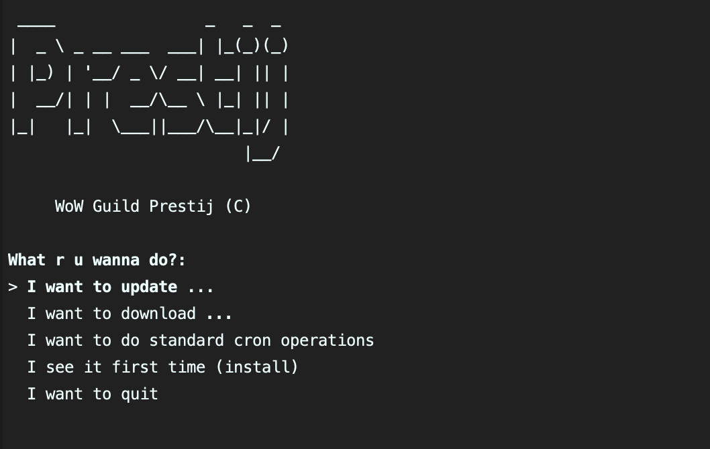

## How to use

1. Rename `config.demo.py` to `config.py` and set it up
2. Use `python main.py` to run the application

### Cron

Application has it own crony entry point. Just use `python -m cron` and pass args:
- `info` (or `guild`) - updates only guild info (counters, names, etc.)
- `characters` (or `guild`) - updates only characters with equipment
- `mythic` (or `guild`) - updates only mythic data
- `avatars` (or `media`) - downloads all guild players avatars
- `items` (or `media`) - downloads all guild players items images
---
- `force__all` - does everything above. **IMPORTANT!** try to avoid usage of this argument!

## Console UI


Use **arrows** and **enter** to select the action. Cron described above is the text version of this UI.

## API methods

For example it uses `http://server.prestij.xyz` domain

- Get the list of the guild players
    ```
    GET http://server.prestij.xyz/characters/list
    ```
    ```
    GET http://server.prestij.xyz/characters/list?offset=10&limit=10
    ```
    *(Use `offset` and `limit` URL params to manipulate the data)*
    

- Get all (extra) information about the guild player
  ```
  GET http://server.prestij.xyz/characters/{character_name}
  ```
  **Important!** Avoid usage of `/characters/list` and `/characters/{character_name}` together. The best way will to download all data via (`/characters/list`) 
  and work with it how it works on http://prestij.xyz
  
- Get the guild info
    ```
    GET http://server.prestij.xyz/guild
    ```
  
- Get the guild mythic races data
    ```
    GET http://server.prestij.xyz/myhtic/list
    ```
    ```
    GET http://server.prestij.xyz/myhtic/list?offset=100&limit=100
    ```
  *(Use `offset` and `limit` URL params to manipulate the data)*
  
 - Get the guild player image
    ```
   http://server.prestij.xyz/static/characters/{character_name_lower}_main.png
   ```
   
 - Get the guild player avatar
     ```
   http://server.prestij.xyz/static/characters/{character_name_lower}_avatar.jpg
   ```
 
 - Get the equipment item image
     ```
   http://server.prestij.xyz/static/items/{image_id}.jpg
   ```
   *(image_id provides in /characters/list method)*
 
